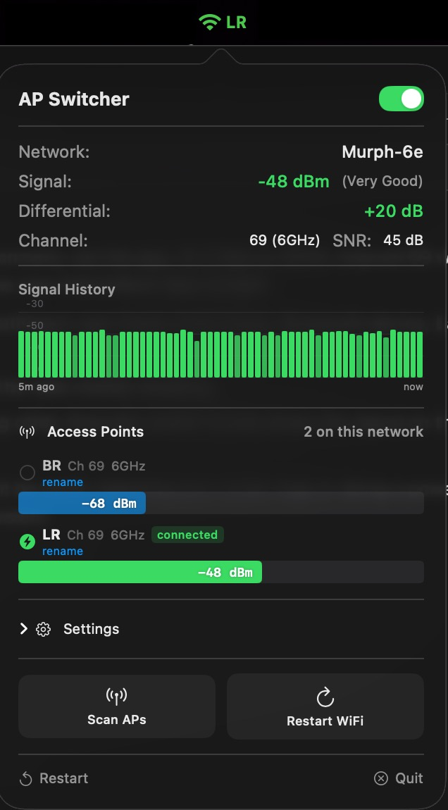
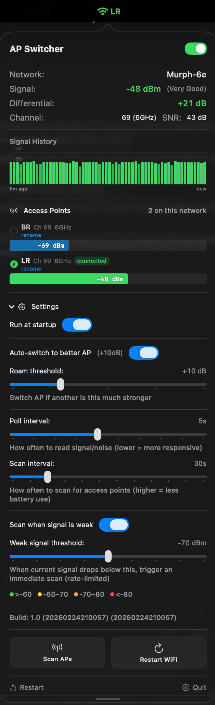

# AP Switcher

A macOS menu bar utility that monitors WiFi signal strength and automatically roams (switches between) access points on the same network.

iOS devices like iPhones and iPads are designed for mobility — they roam aggressively, constantly seeking out the strongest access point as you move around. MacBooks take the opposite approach. macOS prioritizes connection stability over signal strength, so it tends to hold onto the current AP even when a much stronger one is available nearby. This means your MacBook can sit with a weak, distant AP while a strong one is right next to you.

AP Switcher fixes this by continuously monitoring signal quality across all access points on your network and automatically switching when a significantly better option is available. It gives your Mac the roaming intelligence that Apple built into iOS but left out of macOS — configurable, visible, and under your control from the menu bar.

## Screenshots

<p align="center">
  
  <br/><br/>
  
</p>

## Features

- **Real-time signal monitoring** — RSSI, noise floor, SNR, channel, and band displayed at a glance
- **Signal history graph** — 5-minute rolling view of signal strength
- **Automatic AP roaming** — switches to a stronger access point when the differential exceeds a configurable threshold
- **Access point discovery** — scans and lists all APs on the current network with signal bars
- **Custom AP naming** — assign friendly names (e.g. "Kitchen", "Office") to each BSSID
- **Differential indicator** — shows how much stronger the current AP is vs. the next best
- **Weak signal scanning** — triggers an immediate AP scan when signal drops below a threshold
- **Menu bar indicator** — color-coded signal icon with AP name or dBm in the menu bar
- **Roaming history** — log of recent AP switches with before/after signal levels
- **Launch at login** — optional startup item
- **Manual controls** — force scan, manual AP switch, WiFi restart

## Requirements

- macOS 14.0 (Sonoma) or later
- Swift 5.9+
- Location permission (required by macOS to read WiFi network info)

## Build & Install

Clone the repo and run the build script:

```bash
git clone https://github.com/infinityanalytics/ap-switcher.git
cd ap-switcher
./scripts/build-and-install.sh release
```

This will:

1. Build with Swift Package Manager
2. Generate the app icon
3. Create a signed `.app` bundle
4. Install to `/Applications/AP Switcher.app`

Admin permission is required for the install step. If running from a non-interactive shell, run it from Terminal so `sudo` can prompt for a password.

For development builds:

```bash
./scripts/build-and-install.sh debug
```

After installing, quit and relaunch the app if it was already running.

## Permissions

On first launch, AP Switcher will request:

- **Location** — required by macOS to access WiFi network names and BSSID info. Without this, access point scanning is unavailable.

The app runs entirely on-device. No data is sent anywhere.

## How It Works

AP Switcher polls the current WiFi interface at a configurable interval (default 5s) to read signal strength and noise. It periodically scans for nearby access points on the same SSID (default every 30s). When it finds an AP with a signal significantly stronger than the current one (default +10 dB), it triggers a roam using CoreWLAN.

All settings — roam threshold, poll interval, scan interval, weak signal threshold, and AP names — persist across launches via UserDefaults.

## Project Structure

```
ap-switcher/
├── Package.swift
├── APSwitcher.entitlements
├── scripts/
│   ├── build-and-install.sh
│   └── generate-icon.swift
└── Sources/APSwitcher/
    ├── main.swift              # Entry point
    ├── APSwitcherApp.swift     # App delegate, menu bar, popover
    ├── WiFiMonitor.swift       # Core WiFi monitoring and roaming logic
    ├── MenuBarView.swift       # SwiftUI interface
    ├── LocationManager.swift   # Location permission handling
    ├── LoginItemManager.swift  # Launch-at-login support
    └── SingleInstanceLock.swift
```

## License

MIT — see [LICENSE](LICENSE).
